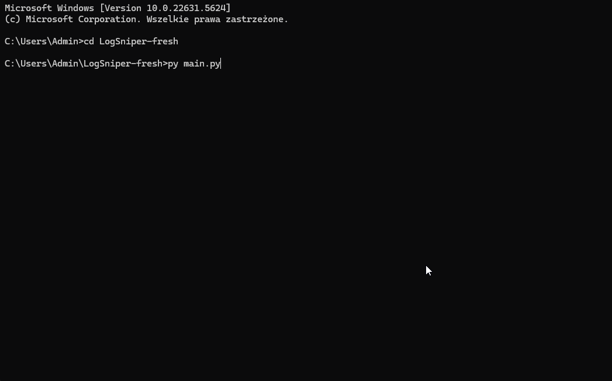

# LogSniper

**LogSniper** is a lightweight security log parser built to detect and classify potential threats in system and web logs - such as failed logins, brute-force attempts, suspicious HTTP scanning, and privilege escalations.

## Project Goal

The primary objective of **LogSniper** is to provide a practical tool to enhance cybersecurity by parsing and analyzing system and web logs for potential security threats. This tool lays the foundation for the following:

- **Building a Blue Team / SOC toolset**
- Future expansion into a **lightweight SIEM** or a **honeypot**
- **Threat hunting** by identifying security events like failed logins, suspicious scanning, and privilege escalation

## What's New

**v0.2 – Geolocation & API request limiting**
- **Automatic IP geolocation** for all log types (access, auth, evtx): Each detected event is enriched with country, region, city, and timezone using ip-api.com.

- **API limit awareness**: Geolocation requests are throttled to 40 per minute (in line with the API provider's fair usage policy). If the script reaches this limit, it will automatically pause and resume when allowed.

## How to Use

1. **Install Dependencies**:

```bash
pip install -r requirements.txt
```
2. **Run the main program**:
```bash
python main.py
```
Upon running, the program will prompt you to choose which log type to analyze:

auth — to parse authentication logs (e.g., auth.log)

access — to parse web server access logs (e.g., access.log)

evtx — to parse Windows Event Logs (e.g., Security.evtx)

3. **Results**:

After processing, results are saved in the results/ folder as JSON files.

## Demo

Here's a quick demo of **LogSniper** in action:



## Automated Testing with test_runner.py

The test_runner.py script automates the testing of parsers for various log files. Simply place your log files in the test_logs/ folder, and the script will process each file, storing the results as JSON files in the results/ folder.
```bash
python test_runner.py
```
This ensures that any new detection rules or parser updates are properly validated.

## Supported Events

### System Log Events (auth.log)

| Event Type            | Description                                                                               |
| --------------------- | ----------------------------------------------------------------------------------------- |
| FAILED\_LOGIN         | Failed login attempt                                                                      |
| BRUTE\_FORCE\_ATTEMPT | 10 failed logins from same IP                                                             |
| SUDO\_USAGE           | Use of administrative privileges (sudo)                                                   |
| SUCCESSFUL\_LOGIN     | Successful login                                                                          |
| SUSPICIOUS\_HOURS     | Activity (successful login or sudo usage) occurring during suspicious hours (22:00–05:00) |

### Web Log Events (access.log)

| Event Type                           | Description                                          |
| ------------------------------------ | ---------------------------------------------------- |
| SQLMAP\_SCANNER                      | User-Agent contains `sqlmap`                         |
| CURL\_SCANNER                        | User-Agent is `curl`, indicating automation          |
| NIKTO\_SCANNER                       | Known Nikto scan pattern                             |
| STRANGE\_METHOD                      | Suspicious HTTP method (e.g., OPTIONS, HEAD, DELETE) |
| POTENTIAL\_BRUTEFORCE                | Repeated 403s to `/login`                            |
| POTENTIAL\_404\_FLOOD                | 20+ 404s from same IP                                |
| POTENTIAL\_SCAN                      | Multiple IPs probing same path                       |
| POTENTIAL\_SETUP\_CGI\_SCANNER       | Access to `setup.cgi`                                |
| POTENTIAL\_CONFIG\_PHP\_SCANNER      | Access to `config.php`                               |
| POTENTIAL\_SUSPICIOUS\_PATH\_SCANNER | Access to `/hidden` or similar paths                 |

### Windows Event Logs (EVTX)

| Event Type                                | Description                                                                                  | MITRE ATT&CK ID |
| ----------------------------------------- | -------------------------------------------------------------------------------------------- | ---------------- |
| BRUTE_FORCE_FAILED_LOGINS                 | 3+ failed login attempts (4625/5379) from same IP/account within 60 seconds                  | T1110            |
| CREATE_OR_MODIFY_SYSTEM_PROCESS           | Creation or modification of a Windows service (4697/7045) in unusual paths (e.g., AppData)   | T1543.003        |
| ABUSE_ELEVATION_CONTROL_MECHANISM         | Suspicious process creation (4688) involving `cmd.exe`, `services.exe`, or `rundll32.exe` with specific arguments (e.g., `echo`, `\\pipe\\`, `,a /p:`) | T1548            |

## Geolocation Enrichment

- Every log entry is enriched with:

    - country

    - region

    - city

    - timezone

- Geolocation is performed via ip-api.com (up to 40 requests/minute per their policy).

- If an IP can't be geolocated (e.g., private IP or rate limit hit), relevant fields will be set as "Unknown".

## Project Structure
```bash
LogSniper/
│
├── test_logs/               # Sample log files for testing
├── results/            # Output files (JSON results)
├── src/                # Source code (analyzers, parsers, rules etc.)
├── doc/                # Notes, diagrams, sketches
├── main.py             # Main program entry point
├── test_runner.py      # Automated testing script
├── README.md           # Project documentation
```
## Sample Input Log
```bash
Jul 24 22:10:01 server sshd[1234]: Failed password for user alice from 192.168.1.50 port 51412 ssh2
```
Parsed into:
```bash
[FAILED_LOGIN] Time: Jul 24 22:10:01, IP: 192.168.1.50, User: alice
```

## Detection Sources / Inspirations

- MITRE ATT&CK
- Sigma Rules
- GTFOBins
- Blue Team Cheat Sheet
- TryHackMe / Hack The Box Labs

## Author

Bartłomiej Biskupiak

This is part of my blue team / cybersecurity learning path.

## Project Status

**In active development** – Most features are functional, with planned updates for new detection rules and integrations.

## Roadmap Components

- Log parser for auth.log - **DONE**

- Basic web log analysis from access.log - **DONE**

- EVTX log analysis - **DONE**

- Advanced detection rules - **In progress**

- SQLite or Elastic integration (optional, later)

## Contributing

Want to help? Open an issue or submit a pull request!

This is an educational project - all feedback is welcome.

This project is part of my public cybersecurity portfolio.

Started: July 2025